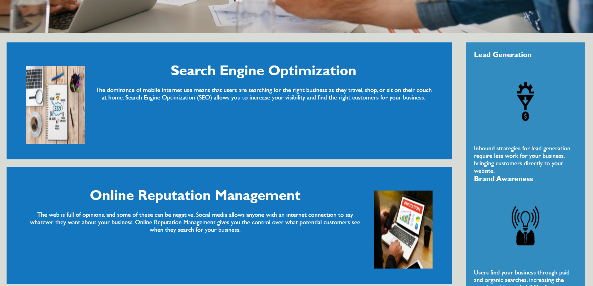
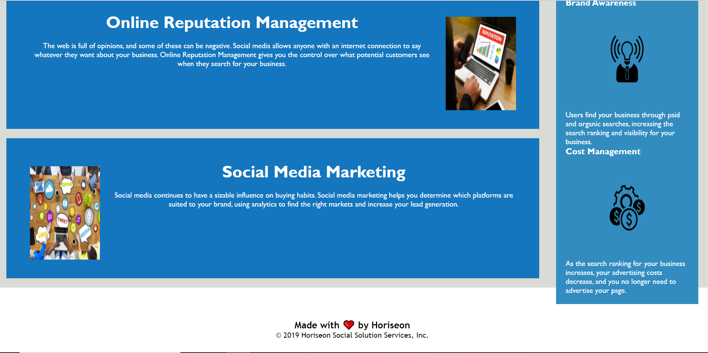

# Homework1 HTML CSS Git: Code Refactor

In this project so this agency I was asked to refactor the code, condense it while not changing what the code does or displays, and to add accesibility to the website. I was able to condense the CSS by removing the various classes used throughout the code and combine this styling with other parts of the code with like styling. I did this by using tags in the index.html that could have their styling linked via the CSS file. Acessibility improves were in the form of alt tags for the images so the screen readers would be able to descibe the images.Some issues that I had in the final product are with the pictures within the main article do not appear to be sized correctly but I was advised by my tutor Quint Turner that since I was using the sizing from the original sourse code to not spend too much time on this as it most likely do to page sizing/resolution which is something that will be addressed later in this course.

Screenshots:
side note: Screenshots of the website are in the form of 3 screenshot so that would be the reason for the page breaks between images displayed in this read me file.

Link to repo:

https://github.com/EricMalpass/Homework1/tree/main/assets

Link to active website:

https://ericmalpass.github.io/Homework1/

I recieve alot of support from my study group, tutur, askbcs tuturs, and various websites:
Study Group:

-Daniel Phan

-Christine Nguyen

-LiHua Anderson

-Sam Oberg

-Sandra de la Torre

-Kelly Dean Mahaffey

-Branden harrington

Tutur 

-Quint Turner

Main websites:

https://www.w3schools.com/

https://docs.github.com/
